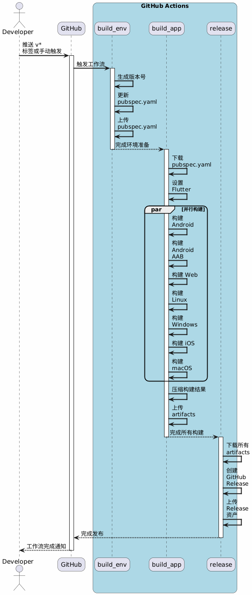

```plantuml
          ┌─────────────────┐   ┌─────────────────┐
          │   推送 v* 标签   │   │    手动触发      │
          └────────┬────────┘   └────────┬────────┘
                   │                     │
                   └──────────┬──────────┘
                              ▼
                    ┌───────────────────┐
                    │     build_env     │
                    │ ───────────────── │
                    │ 生成版本号        │
                    │ 更新 pubspec.yaml │
                    │ 上传 pubspec.yaml │
                    └──────────┬────────┘
                               │
                               ▼
    ┌───────────────────────────────────────────────────────┐
    │                       build_app                       │
    │ ┌─────────┐ ┌─────────┐ ┌───┐ ┌─────┐ ┌───┐ ┌───┐ ┌───┐│
    │ │ Android │ │Android  │ │Web│ │Linux│ │Win│ │iOS│ │Mac││
    │ │         │ │  AAB    │ │   │ │     │ │   │ │   │ │   ││
    │ │1.下载   │ │1.下载   │ │ 1 │ │  1  │ │ 1 │ │ 1 │ │ 1 ││
    │ │2.设置   │ │2.设置   │ │ 2 │ │  2  │ │ 2 │ │ 2 │ │ 2 ││
    │ │3.构建   │ │3.构建   │ │ 3 │ │  3  │ │ 3 │ │ 3 │ │ 3 ││
    │ │4.压缩   │ │4.压缩   │ │ 4 │ │  4  │ │ 4 │ │ 4 │ │ 4 ││
    │ │5.上传   │ │5.上传   │ │ 5 │ │  5  │ │ 5 │ │ 5 │ │ 5 ││
    │ └─────────┘ └─────────┘ └───┘ └─────┘ └───┘ └───┘ └───┘│
    └───────────────────────────┬───────────────────────────┘
                                │
                                ▼
                      ┌───────────────────┐
                      │      release      │
                      │ ───────────────── │
                      │ 下载所有 artifacts │
                      │ 创建 GitHub Release│
                      │ 上传 Release 资产  │
                      └───────────────────┘

图例：
1 = 下载 pubspec.yaml   2 = 设置 Flutter   3 = 构建
4 = 压缩               5 = 上传 artifact
```




工作流程的主要步骤：

# 触发条件：

- 当推送带有 “v” 开头的标签时
- 可以手动触发

# 工作流程包含三个主要任务：

- build_env：更新版本号
- build_app：构建多平台应用
- release：创建发布和上传构建产物

1. build_env 任务：

- 生成版本号
- 更新 pubspec.yaml 中的版本号
- 上传更新后的 pubspec.yaml 文件

2. build_app 任务：

- 使用矩阵策略为不同平台构建应用（Android、iOS、Web、Linux、Windows、macOS）
- 下载更新后的 pubspec.yaml
- 设置 Flutter 环境
- 安装依赖
- 根据平台执行相应的构建命令
- 压缩构建产物
- 上传构建产物作为 artifact

3. release 任务：

- 下载所有构建产物
- 创建 GitHub Release
- 将构建产物上传为 Release 资产